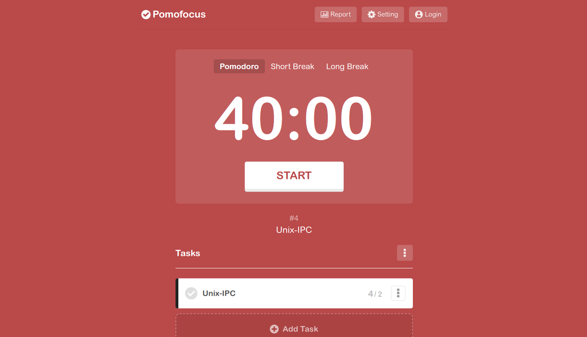
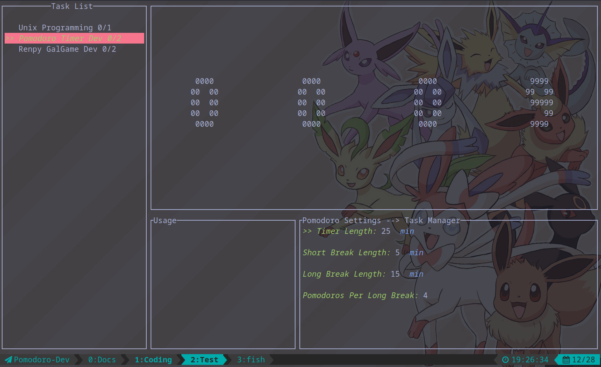
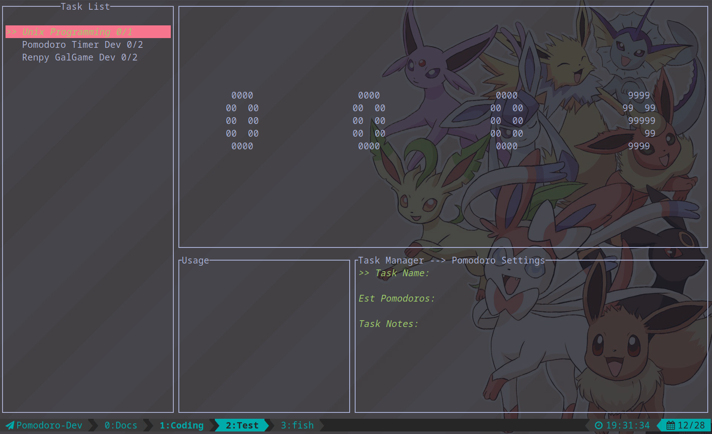

# TUI Pomodoro Timer

A simple Pomodoro Timer implemented in Rust with [`rata-tui`](https://crates.io/crates/ratatui) and [`crossterm`](https://crates.io/crates/crossterm)

[Inspired by pomofocus.io](https://pomofocus.io/)

## Progress

### Basic Features

- [X] Basic User Interface
- [X] Timer Controller(Start, Pause, Skip, Break, Long Break), 12/27
- [X] Task Manager and Task List
    - [X] Add Task, 12/28
    - [X] task specific settings, 12/28
    - [X] delete Tasks, 12/28

- [ ] Vim-like Keybindings; Dynamic Keybindings
- [ ] Help page
- [ ] Usage prompt; State prompt
- [ ] Timer Presets 
- [ ] Stop Watch
- [ ] Store User Settings and Data
- [ ] Backup and restore user's `settings` and `data`

### ColorScheme

- [ ] Different Colors for Different States(default for Pomodoro, `Green` for short break, `Blue` for long break)
- [ ] Padding for widgets
- [ ] Wrap and trim in ratatui
- [ ] Clock Style

### MultiMedia

- [ ] Talk to `PulseAudio` to play sound
- [ ] Talk to `Dbus` to send notifications

### Advanced Features

- [ ] Generate Reports from using statistics
- [ ] Mouse Responsive
